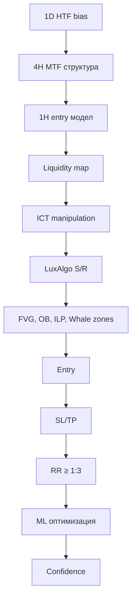

# 🎯 ФИНАЛНО ЗАДАНИЕ: ICT МЕТОДОЛОГИЯ - ПЪЛНА ИНТЕГРАЦИЯ

## 📋 ОБЩА ИНФОРМАЦИЯ

**Дата на създаване:** 2025-12-12  
**Версия:** 1.0  
**Статус:** В процес на имплементация  
**Приоритет:** ВИСОК  

---

## 🎓 ICT МЕТОДОЛОГИЯ - ЗАДЪЛЖИТЕЛНИ ЕЛЕМЕНТИ

### 1. 🐋 СКРИТИ WHALE ПОРЪЧКИ (HQPO)

**Цел:** Идентифициране на висококачествени нерегистрирани институционални поръчки

**Критерии за откриване:**
- ✅ Незапълнени или частично запълнени институционални поръчки
- ✅ Displacement + незабавни FVG (Fair Value Gaps)
- ✅ Движение без фитил → вероятен блок от институционални поръчки

**Маркировка:**
- 🟡 Жълто → Whale Order Blocks
- Етикет: "Whale Order Block"

---

### 2. 💧 ВЪТРЕШНИ ЛИКВИДНИ БАСЕЙНИ (ILP)

**Цел:** Идентифициране на retail ликвидност за институционално събиране

**Критерии:**
- ✅ Equal highs, equal lows
- ✅ Краткосрочни върхове/дъна (STH/STL)
- ✅ Зони, където институциите ще прибират ликвидност

**Класификация:**
- 🔵 Вътрешна buy-side ликвидност (IBSL)
- 🔴 Вътрешна sell-side ликвидност (ISSL)

**Маркировка:**
- 🟢 Зелено → Internal liquidity
- Етикет: "Вътрешна ликвидност"

---

### 3. 🎯 ЗОНИ ЗА СЪБИРАНЕ НА ЛИКВИДНОСТ

**Цел:** Smart Money акумулация/дистрибуция преди експанзия

**Критерии:**
- ✅ Клъстери на неефективност (FVG + imbalance + displacement)
- ✅ Валидни Institutional Order Blocks (IOB)
- ✅ Breaker блокове и mitigation блокове

**Маркировка:**
- 🔵 Синьо → Buy-side liquidity цели
- 🔴 Червено → Sell-side liquidity цели
- Етикет: "Ликвидност таргет"

---

### 4. 📊 ЗАДЪЛЖИТЕЛНО ОБЯСНЕНИЕ ЗА ВСЯКА ЗОНА

За всяка идентифицирана зона трябва да се посочи:

```
✅ Защо китовете действат тук
✅ Каква ликвидност се таргетира
✅ Каква посока вероятно ще наложат институциите
✅ Как зоната се вписва в ICT структурата (BOS, CHOCH, MSB, SIBI/SSIB)
✅ Рейтинг на вероятност (0–100%)
```

---

### 5. 🎨 МАРКИРОВКИ НА ГРАФИКАТА

**Цветова схема:**
- 🔵 Синьо → цели на buy-side liquidity
- 🔴 Червено → цели на sell-side liquidity
- 🟡 Жълто → скрити институционални поръчки (Whale Order Blocks)
- 🟢 Зелено → вътрешна ликвидност (internal liquidity)

**Етикети:**
- "Вътрешна ликвидност"
- "Whale Order Block"
- "FVG зона"
- "Ликвидност таргет"

---

### 6. 📈 ФИНАЛЕН ИЗХОД (ЗАДЪЛЖИТЕЛНО)

Всеки анализ ТРЯБВА да съдържа:

```
✅ Текущ пазарен bias (бик/мечка)
✅ Коя ликвидност ще бъде взета първо (вътрешна или външна)
✅ Най-вероятната цел на цената
✅ Зоната, където институциите ще акумулират или манипулират ликвидност
✅ Модел за вход (CHOCH, BOS, FVG ретест, OTE, SIBI/SSIB и др.)
```

---

### 7. 🎯 ЗАДЪЛЖИТЕЛНИ КОМПОНЕНТИ НА ВСЕКИ СИГНАЛ

**Всеки сигнал ТРЯБВА да съдържа:**

```python
{
    "entry": float,          # Точна входна цена
    "stop_loss": float,      # SL под/над валиден Order Block според ICT
    "take_profit_1": float,  # TP по RR 1:3 (минимум)
    "take_profit_2": float,  # Допълнителен TP ако структурата го изисква (опционално)
    "risk_reward": float,    # RR ≥ 1:3 (задължително)
    "confidence": int        # 0-100%
}
```

**Правила за SL:**
- ✅ Винаги под/над валиден Order Block според ICT
- ✅ Не се поставя на случаен ATR/процент
- ✅ Зачита структурата на пазара

**Правила за TP:**
- ✅ RR минимум 1:3
- ✅ По-добро RR ако пазарът позволява
- ✅ Допълнителни TP базирани на ликвидни зони

---

### 8. 🕐 TIMEFRAME АНАЛИЗ

**Основни таймфремове:**
- 📅 1 ден (HTF bias)
- ⏰ 4 часа (MTF структура)
- ⏱️ 1 час (entry модел)

**Всички останали timeframes също се анализират по същата методология**

---

### 9. 🤖 BACKTEST И БОТ - ЗАДЪЛЖИТЕЛНИ ПРАВИЛА

#### **9.1 Backtest команда**

**Стандартна команда:**
```bash
/backtest BTCUSDT all 15
```

**Функционалност:**
- ✅ Информацията се актуализира всеки ден автоматично
- ✅ Бутонът "Backtest" ЗАДЪЛЖИТЕЛНО използва тази команда
- ✅ Данните се записват в permanent database

#### **9.2 Нова функция: `/backtest_full`**

**Цел:** Пълен анализ на ВСИЧКИ монети и timeframes

**Команда:**
```bash
/backtest_full
```

**Функционалност:**
- ✅ Анализира ВСИЧКИ интегрирани монети
- ✅ Покрива ВСИЧКИ timeframes (1D, 4H, 1H, 15M и др.)
- ✅ Генерира unified database за ML обучение
- ✅ Създава baseline statistics за comparisons

**Изпълнение:**
- ⏰ Може да отнеме 10-30 минути
- 📊 Генерира обща статистика за целия период
- 💾 Archive система за permanent storage

---

### 10. 📊 ОТЧЕТИ (ДНЕВЕН, СЕДМИЧЕН, МЕСЕЧЕН)

**Правила:**
- ✅ Всички отчети използват информацията от `/backtest BTCUSDT all 15`
- ✅ Актуализация на общата статистика само за успех/неуспех
- ✅ Данните се извличат от permanent database

**Структура на отчетите:**

```markdown
## 📊 ДНЕВЕН ОТЧЕТ

### Real-time сигнали:
- Брой сигнали: X
- Успешни: Y (Z%)
- Неуспешни: W (Q%)

### Обща статистика (Backtest baseline):
- Исторически успеваемост: X%
- Средно RR: Y:1
- Sharpe Ratio: Z
```

---

### 11. 🧠 MACHINE LEARNING ПРАВИЛА

**Разрешено:**
- ✅ Продължава да се самообучава
- ✅ Оптимизира вход, SL и TP
- ✅ Адаптира confidence базирано на backtest резултати

**ЗАБРАНЕНО:**
- ❌ НЕ МОЖЕ да променя стратегията
- ❌ НЕ МОЖЕ да нарушава ICT правилата
- ❌ НЕ МОЖЕ да нарушава RR ≥ 1:3

**ML оптимизация:**
```python
# Винаги оценява сетъпа спрямо резултатите от backtest-а
if ml_confidence > backtest_baseline:
    signal_confidence += 10
else:
    signal_confidence -= 5
```

---

### 12. 🔔 ALERT СИСТЕМА

**Функции за проверка:**

#### **12.1 Достигане на 80% от целта**
```python
def check_80_percent_target(signal):
    """
    При достигане на 80% от TP1:
    - Изпраща алерт
    - Дава насока със следващи стъпки
    - Предлага trailing stop опция
    """
    pass
```

#### **12.2 Финален алерт за сигнал**
```python
def send_final_alert(signal, result):
    """
    При затваряне на сигнал:
    - Изпраща финален алерт
    - Маркира като успешен или неуспешен
    - Записва в database за ML обучение
    """
    pass
```

---

### 13. 🔄 АНАЛИЗ В РЕАЛНО ВРЕМЕ - ПОСЛЕДОВАТЕЛНОСТ

**ЗАДЪЛЖИТЕЛНА ПОСЛЕДОВАТЕЛНОСТ:**



**Всеки анализ ТРЯБВА да следва тази последователност за всички timeframes**

---

## 🚀 IMPLEMENTATION CHECKLIST

### ✅ Фаза 1: Core ICT Methodology
- [ ] Whale Order Block detection
- [ ] Internal Liquidity Pool identification
- [ ] Smart Money zone mapping
- [ ] Графична маркировка система

### ✅ Фаза 2: Backtest Enhancement
- [ ] `/backtest_full` команда
- [ ] Archive database система
- [ ] Unified statistics generation
- [ ] Bootstrap sequence при startup

### ✅ Фаза 3: Reports & Alerts
- [ ] Обща статистика в отчетите
- [ ] 80% target alert система
- [ ] Финален alert механизъм
- [ ] Real vs Baseline comparison

### ✅ Фаза 4: ML Integration
- [ ] ML адаптация с ICT правила
- [ ] Backtest-based confidence adjustment
- [ ] Strategy validation против backtest baseline

### ✅ Фаза 5: Real-time Analysis
- [ ] Multi-timeframe последователност
- [ ] HTF → MTF → LTF анализ
- [ ] Entry model генериране
- [ ] NO TRADE scenarios

---

## 📦 DATABASE SCHEMA (НОВО)

### **Backtest Archive Table**

```sql
CREATE TABLE backtest_archive (
    id INTEGER PRIMARY KEY,
    symbol TEXT,
    timeframe TEXT,
    date DATE,
    win_rate REAL,
    avg_rr REAL,
    total_signals INTEGER,
    successful_signals INTEGER,
    failed_signals INTEGER,
    sharpe_ratio REAL,
    max_drawdown REAL,
    created_at TIMESTAMP
);
```

### **Whale Order Blocks Table**

```sql
CREATE TABLE whale_order_blocks (
    id INTEGER PRIMARY KEY,
    symbol TEXT,
    timeframe TEXT,
    price_level REAL,
    zone_type TEXT, -- 'buy' or 'sell'
    confidence INTEGER,
    identified_at TIMESTAMP,
    still_valid BOOLEAN
);
```

### **Internal Liquidity Pools Table**

```sql
CREATE TABLE internal_liquidity_pools (
    id INTEGER PRIMARY KEY,
    symbol TEXT,
    timeframe TEXT,
    price_high REAL,
    price_low REAL,
    pool_type TEXT, -- 'IBSL' or 'ISSL'
    target_probability INTEGER,
    identified_at TIMESTAMP
);
```

---

## 🔧 INTEGRATION POINTS

### **bot.py**
- Добавяне на `/backtest_full` command handler
- Integration на whale detection в сигнални функции
- Добавяне на 80% alert checker

### **backtesting.py**
- Нова функция `run_full_backtest()`
- Archive система за historical data
- Bootstrap sequence при startup

### **ml_engine.py**
- Validation спрямо backtest baseline
- ICT-compliant optimization
- Strategy integrity checks

### **daily_reports.py**
- "Обща статистика" секция
- Real vs Baseline comparison
- Archive data visualization

---

## ⚠️ ВАЖНИ БЕЛЕЖКИ

### **НЕПРОМЕНЯЕМИ ПРАВИЛА:**
1. ❌ ML НЕ може да променя стратегията
2. ❌ RR винаги ≥ 1:3
3. ❌ SL винаги базиран на валиден ICT Order Block
4. ❌ Не се нарушават ICT правила

### **АДАПТИВНИ ЕЛЕМЕНТИ:**
1. ✅ Entry оптимизация в рамките на ICT
2. ✅ Confidence adjustment
3. ✅ TP enhancement базирано на ликвидни зони

---

## 📝 ФИНАЛНА ВАЛИДАЦИЯ

Всеки анализ и сигнал ТРЯБВА да премине през:

```python
def validate_signal(signal):
    checks = {
        "has_entry": signal.entry is not None,
        "has_sl": signal.stop_loss is not None,
        "has_tp": signal.take_profit_1 is not None,
        "rr_valid": signal.risk_reward >= 1.3,
        "ict_compliant": validate_ict_structure(signal),
        "htf_analyzed": signal.htf_bias is not None,
        "liquidity_mapped": signal.liquidity_zones is not None,
        "confidence_set": 0 <= signal.confidence <= 100
    }
    
    return all(checks.values()), checks
```

---

## 🎯 УСПЕХ КРИТЕРИИ

Системата е успешно имплементирана когато:

✅ Всички backtest данни се архивират автоматично  
✅ `/backtest_full` генерира обща статистика  
✅ Отчетите показват real vs baseline comparison  
✅ Whale zones се идентифицират и маркират  
✅ ILP се детектират и класифицират  
✅ Всеки сигнал има пълен ICT анализ  
✅ ML оптимизира без да нарушава правилата  
✅ Alert системата работи на 80% и финал  
✅ HTF → MTF → LTF последователност винаги се изпълнява  

---

## 🚀 СЛЕДВАЩИ СТЪПКИ

1. ✅ Review на документа от разработчика
2. ⏳ Имплементация на Фаза 1
3. ⏳ Testing на whale detection
4. ⏳ Имплементация на `/backtest_full`
5. ⏳ Integration testing
6. ⏳ Production deployment

---

**Създаден от:** AI Assistant  
**За проект:** Crypto-signal-bot  
**Версия:** 1.0  
**Дата:** 2025-12-12  

---

**КРАЙ НА ДОКУМЕНТА**