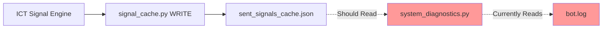
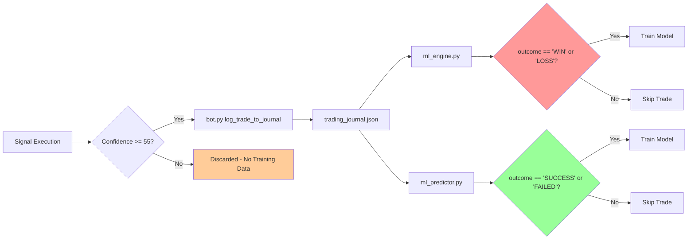
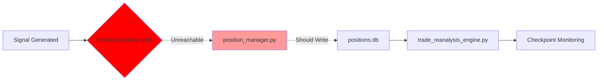

# Phase Ω: Data Flow Matrix

## Data Storage Overview

The system uses a hybrid storage architecture combining:
- **JSON Files** - Persistent data (signals, reports, journal, configs)
- **SQLite Database** - Relational data (positions, checkpoints, alerts)
- **Memory Cache** - Runtime state (current signals, session data)
- **Log Files** - System diagnostics and audit trails

### Storage Hierarchy
```
/Crypto-signal-bot/
├── sent_signals_cache.json      [Signal Cache - WRITE: signal_cache.py, READ: Should be system_diagnostics.py ⚠️]
├── daily_reports.json            [Reports - WRITE: daily_reports.py, READ: Should be system_diagnostics.py ⚠️]
├── trading_journal.json          [Trades - WRITE: bot.py, READ: ml_engine.py, ml_predictor.py, journal_backtest.py]
├── positions.db                  [Positions - WRITE: position_manager.py, READ: trade_reanalysis_engine.py]
├── bot.log                       [Logs - WRITE: All components, READ: system_diagnostics.py]
└── backtest_results/             [Archives - WRITE: ict_backtest_simulator.py, READ: None ⚠️]
```

---

## Data Sources

### Primary Data Sources
| Source | Type | Update Frequency | Components |
|--------|------|------------------|------------|
| **Binance API** | External | Real-time | ict_signal_engine.py, bot.py |
| **User Commands** | External | On-demand | bot.py, telegram handlers |
| **Scheduler Jobs** | Internal | Scheduled | Auto-signals (1-4h), Daily reports (24h), ML training (7d) |
| **Position Monitoring** | Internal | Continuous | position_manager.py, trade_reanalysis_engine.py |

### Data Flow Entry Points
1. **Market Data** → `ict_signal_engine.py` → Signal generation
2. **User Input** → `bot.py` handlers → Command execution
3. **Scheduled Tasks** → `scheduler` jobs → Automated analysis
4. **Trade Execution** → `position_manager.py` → Position tracking

---

## Data Structures

### 1. Sent Signals Cache (`sent_signals_cache.json`)
```json
{
  "signals": [
    {
      "symbol": "BTCUSDT",
      "timeframe": "15m",
      "signal_type": "BUY",
      "confidence": 72,
      "entry_price": 45230.5,
      "sl_price": 44980.0,
      "tp_price": 45980.0,
      "timestamp": 1705934400,
      "hash": "abc123..."
    }
  ],
  "last_updated": 1705934400
}
```

**Write Location:** `signal_cache.py:72-89` (`save_sent_signals()`)  
**Read Location:** ⚠️ **MISSING** - `system_diagnostics.py` checks logs instead  
**Issue:** See Ω2-002

---

### 2. Daily Reports (`daily_reports.json`)
```json
{
  "reports": [
    {
      "date": "2024-01-22",
      "signals_sent": 12,
      "win_rate": 67.5,
      "total_profit_pct": 8.3,
      "best_trade": {"symbol": "BTCUSDT", "profit": 2.1},
      "worst_trade": {"symbol": "ETHUSDT", "loss": -0.8},
      "timestamp": 1705881600
    }
  ]
}
```

**Write Location:** `daily_reports.py:302-321` (`_save_report()`)  
**Read Location:** ⚠️ **PARTIAL** - `system_diagnostics.py:453` checks logs only  
**Issue:** See Ω2-001

---

### 3. Trading Journal (`trading_journal.json`)
```json
{
  "trades": [
    {
      "symbol": "BTCUSDT",
      "timeframe": "1h",
      "signal_type": "BUY",
      "confidence": 68,
      "entry_price": 45230.5,
      "sl_price": 44980.0,
      "tp_price": 45980.0,
      "outcome": "SUCCESS",  // ⚠️ ml_engine.py expects "WIN"/"LOSS" (Ω2-006)
      "profit_pct": 1.65,
      "timestamp": 1705934400,
      "conditions": {
        "rsi": 45,
        "displacement": true,
        "structure_break": true
      }
    }
  ],
  "metadata": {
    "total_trades": 247,
    "last_updated": 1705934400
  }
}
```

**Write Location:** `bot.py` (`log_trade_to_journal()`) - Threshold: `confidence >= 55`  
**Read Locations:**
- `ml_engine.py:190-217` - Expects `outcome in ['WIN', 'LOSS']` ⚠️
- `ml_predictor.py:264-300` - Expects `outcome in ['SUCCESS', 'FAILED']` ✅
- `daily_reports.py:22-40` - Generic read
- `journal_backtest.py` - Read-only analysis

**Issues:**
- Ω2-006: Outcome field mismatch
- Ω2-007: Confidence threshold may exclude useful training data

---

### 4. Positions Database (`positions.db`)

**Schema:**
```sql
CREATE TABLE open_positions (
    id INTEGER PRIMARY KEY,
    symbol TEXT NOT NULL,
    entry_price REAL NOT NULL,
    sl_price REAL NOT NULL,
    tp_price REAL NOT NULL,
    confidence INTEGER,
    checkpoint_25_triggered INTEGER DEFAULT 0,  -- Checkpoints for re-analysis
    checkpoint_50_triggered INTEGER DEFAULT 0,
    checkpoint_75_triggered INTEGER DEFAULT 0,
    checkpoint_85_triggered INTEGER DEFAULT 0,
    opened_at TIMESTAMP DEFAULT CURRENT_TIMESTAMP
);

CREATE TABLE checkpoint_alerts (
    id INTEGER PRIMARY KEY,
    position_id INTEGER,
    checkpoint_level TEXT,
    recommendation TEXT,  -- HOLD / CLOSE_NOW / PARTIAL_CLOSE / MOVE_SL
    confidence_delta REAL,
    timestamp TIMESTAMP DEFAULT CURRENT_TIMESTAMP
);
```

**Write Location:** `position_manager.py` (`open_position()`, `mark_checkpoint_triggered()`)  
**Read Location:** `trade_reanalysis_engine.py`, `position_manager.py`  
**Issue:** ⚠️ Ω2-015 - Position opening code unreachable in bot.py:11479

---

## Data Flow Patterns

### Pattern 1: Signal Generation → Cache → Diagnostics ⚠️



**Issue:** Diagnostics rely on logs, not authoritative cache file  
**Fix:** Ω2-002 - Read cache file modification time

---

### Pattern 2: Daily Report → Storage → Diagnostics ⚠️


**Issue:** Diagnostics check logs for "Daily report sent successfully" string  
**Fix:** Ω2-001 - Check file timestamp + content validation

---

### Pattern 3: Trading Journal → ML Training ⚠️



**Issues:**
- 50-54% confidence signals lost (no training data)
- ml_engine expects different outcome field than ml_predictor
- **Fixes:** Ω2-007 (lower threshold), Ω2-006 (standardize fields)

---

### Pattern 4: Position Tracking → Re-analysis ❌



**Issue:** Code at bot.py:11479 is after function end (unreachable)  
**Fix:** Ω2-015 - Relocate position opening code

---

## Cache Management

### Signal Cache (`sent_signals_cache.json`)
- **Purpose:** Prevent duplicate signals within cooldown period
- **Retention:** Last 100 signals (rolling window)
- **Cleanup:** Signals older than 24h removed on write
- **Hash Function:** `sha256(symbol + timeframe + signal_type + entry_price)`

**Code:** `signal_cache.py:94-132`

---

### ML Model Cache
- **Files:** `ml_model.pkl`, `ml_scaler.pkl`
- **Update Frequency:** Every 7 days (if 50+ trades available)
- **Auto-training:** ⚠️ Method exists but no scheduler job (Ω2-004)

---

## State Persistence

### Session State (Memory)
| Component | State Stored | Lifetime |
|-----------|-------------|----------|
| `ml_engine` | Model, scaler, accuracy | Until restart |
| `ict_signal_engine` | Market data cache | 5 minutes |
| `position_manager` | DB connection pool | Until restart |
| `scheduler` | Job queue | Until restart |

### Persistent State (Files)
| File | Purpose | Backup Strategy |
|------|---------|-----------------|
| `sent_signals_cache.json` | Deduplication | Daily backup (auto-fixer) |
| `daily_reports.json` | Historical reports | 30-day retention |
| `trading_journal.json` | All trades | Permanent (no cleanup) |
| `positions.db` | Active positions | Daily backup |

---

## Database Operations

### Position Manager (`position_manager.py`)

**Operations:**
1. **Open Position** (`open_position()`) - Lines 135-185
2. **Mark Checkpoint** (`mark_checkpoint_triggered()`) - Lines 288-343
3. **Close Position** (`close_position()`) - Lines 378-428
4. **Get Active Positions** (`get_active_positions()`) - Lines 215-245

**Connection Pooling:** Single connection per instance, thread-safe locks

**Schema Validation:** Whitelist-based column validation (lines 318-345)

---

## File System Usage

### Directory Structure
```
/Crypto-signal-bot/
├── *.json                    [Config & Data]
├── *.db                      [SQLite Databases]
├── *.log                     [System Logs]
├── backtest_results/         [Backtest archives - NOT consumed ⚠️]
│   ├── BTCUSDT_15m_backtest.json
│   └── archive/              [30-day retention]
├── config/
│   ├── ict_config.json
│   └── risk_config.json
└── legacy_backtest/          [Deprecated strategies ⚠️]
    ├── backtesting_old.py    [Simple RSI - NOT ICT-compliant]
    └── ict_backtest_simulator.py [ICT-compliant but no ML]
```

**Issues:**
- Ω2-010: Backtest results not consumed
- Ω2-008: Legacy backtest doesn't match current strategy

---

## Memory Management

### Large Data Structures
| Component | Size | Mitigation |
|-----------|------|------------|
| Market Data Cache | ~50MB | 5-minute TTL |
| ML Training Data | ~10MB | Loaded on-demand |
| Position Database | ~5MB | Indexed queries |
| Log Files | Unbounded | Log rotation (500MB max) |

### Garbage Collection
- Automatic cleanup of expired signal cache entries
- Position archival after closure
- Backtest result retention (30 days)

---

## Data Integrity

### Validation Layers

1. **Input Validation**
   - Signal confidence: 0-100 range
   - Price values: > 0
   - Timestamps: Unix epoch format

2. **File Locking**
   - JSON writes use atomic operations
   - Database uses transactions
   - Log rotation uses safe rename

3. **Error Recovery**
   - Corrupt JSON → Load from backup
   - DB lock timeout → Retry with backoff
   - Missing files → Initialize defaults

---

## Synchronization Mechanisms

### Multi-Process Coordination
- **File-based locks:** `sent_signals_cache.json.lock`
- **Database locks:** SQLite WAL mode
- **Scheduler locks:** APScheduler job IDs

### Race Condition Prevention
- Signal cache hash-based deduplication
- Position opening with UNIQUE constraint
- Checkpoint marking with atomic updates

---

## Read/Write Mismatch Table

| Component | Data File | Write Location | Read Location | Mismatch? | Issue ID |
|-----------|-----------|----------------|---------------|-----------|----------|
| **Signals** | `sent_signals_cache.json` | `signal_cache.py:72-89` | ❌ `system_diagnostics.py` uses logs | **YES** | Ω2-002 |
| **Daily Reports** | `daily_reports.json` | `daily_reports.py:302-321` | ⚠️ `system_diagnostics.py` uses logs | **PARTIAL** | Ω2-001 |
| **Trading Journal** | `trading_journal.json` | `bot.py` (confidence ≥55) | ✅ `ml_engine.py`, `ml_predictor.py` | **NO** | - |
| **Journal Outcome** | `trading_journal.json` | `bot.py` writes "SUCCESS"/"FAILED" | ❌ `ml_engine.py` expects "WIN"/"LOSS" | **YES** | Ω2-006 |
| **Positions** | `positions.db` | ❌ `position_manager.py` (unreachable) | ✅ `trade_reanalysis_engine.py` | **YES** | Ω2-015 |
| **Backtest Results** | `backtest_results/*.json` | `ict_backtest_simulator.py:372` | ❌ No readers | **YES** | Ω2-010 |

---

## Diagnostic Observations

### ✅ Working Correctly
1. **Journal backtest analysis** - Read-only by design, correctly implemented
2. **Re-analysis checkpoint system** - Fully implemented with DB tracking
3. **Signal deduplication** - Hash-based cache working as expected
4. **ML Engine hybrid mode** - Adaptive weighting operational

### ⚠️ Partial Issues
1. **Health diagnostics** - Log-based instead of file-based (Ω2-001, Ω2-002, Ω2-003)
2. **ML training data** - Threshold at 55% may exclude useful signals (Ω2-007)
3. **Legacy backtests** - Missing ML hybrid mode (Ω2-009)

### ❌ Critical Gaps
1. **Position tracking** - Code unreachable, DB never populated (Ω2-015)
2. **Outcome field mismatch** - ml_engine vs ml_predictor expectations differ (Ω2-006)
3. **ML auto-training** - Method exists but no scheduler job (Ω2-004)

---

## Data Flow Diagrams

### Complete Signal Lifecycle
```
1. Market Data → ICT Signal Engine
2. Signal Generated → signal_cache.py (deduplication check)
3. Cache Check Pass → Bot sends to Telegram
4. Confidence ≥55 → Log to trading_journal.json
5. Journal Entry → ML Engine training (auto-retrain every 7d)
6. Position Opening → ❌ UNREACHABLE CODE (Ω2-015)
7. Re-analysis → ✅ Checkpoint monitoring (waiting for positions)
```

### Health Check Data Flow
```
1. Scheduler triggers → system_diagnostics.py
2. Check logs for "Daily report sent successfully" → ⚠️ Should check daily_reports.json
3. Check logs for "auto_signal_job" → ⚠️ Should check sent_signals_cache.json
4. Check ML model age → ⚠️ Should verify training_journal.json trade count first
5. Report issues → Telegram notification
```

---

## Storage Location Map

### Absolute Paths
```
/home/runner/work/Crypto-signal-bot/Crypto-signal-bot/
├── sent_signals_cache.json              [Signal deduplication]
├── daily_reports.json                   [24h summaries]
├── trading_journal.json                 [All trades ≥55% confidence]
├── positions.db                         [Active positions + checkpoints]
├── bot.log                              [System logs - 500MB rotation]
├── ml_model.pkl                         [Trained ML Engine model]
├── ml_scaler.pkl                        [Feature scaler]
├── backtest_results/                    [Archive - not consumed]
└── config/
    ├── ict_config.json                  [ICT parameters]
    └── risk_config.json                 [Risk management]
```

---

**Document Version:** 1.0 (Phase Ω.2 Complete)  
**Cross-Reference:** See `PHASE_OMEGA_FIX_MATRIX.md` for remediation details
